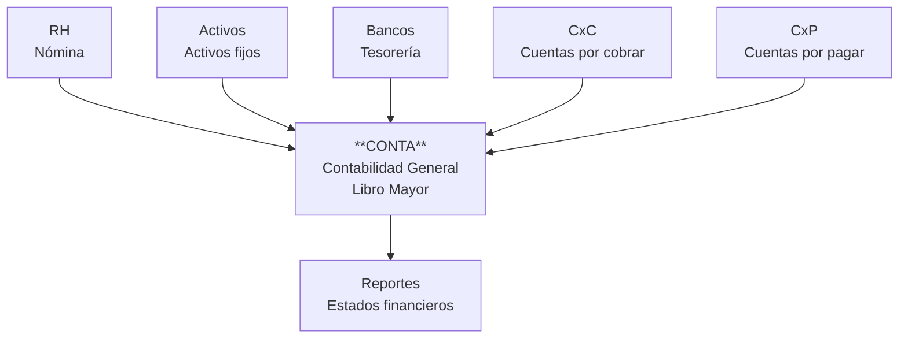

# Contikos

Sistema contable modular tipo QuickBooks / ERP financiero.

La arquitectura es **hub-and-spoke**: un núcleo de Contabilidad General (el "hub")
y seis módulos satélite que le alimentan asientos de partida doble.



> **Nota sobre el diagrama de referencia:** en el boceto original la flecha de
> `reportes` apunta hacia `conta`. En la implementación se invierte: **reportes
> es el único módulo que consume del mayor en lugar de alimentarlo.** Ver
> [`docs/09-modulo-reportes.md`](docs/09-modulo-reportes.md).

## Principio rector

**`conta` no conoce a los módulos.** Los módulos subsidiarios conocen a `conta`.

Toda integración pasa por un único contrato: el **asiento contable**
([`docs/02-contrato-asientos.md`](docs/02-contrato-asientos.md)). Ningún módulo
escribe directamente en el libro mayor ni consulta las tablas internas de otro
módulo.

Consecuencia práctica: añadir un módulo nuevo (inventarios, proyectos, punto de
venta) no requiere tocar el núcleo contable.

## Documentación

| Doc | Contenido |
|---|---|
| [01 — Arquitectura](docs/01-arquitectura.md) | Capas, límites entre módulos, multiempresa, multimoneda |
| [02 — Contrato de asientos](docs/02-contrato-asientos.md) | **El documento clave.** Cómo un módulo contabiliza |
| [03 — Contabilidad General](docs/03-modulo-contabilidad.md) | Catálogo de cuentas, asientos, mayor, periodos, cierre |
| [04 — CxC](docs/04-modulo-cxc.md) | Clientes, facturación, cobranza, antigüedad de saldos |
| [05 — CxP](docs/05-modulo-cxp.md) | Proveedores, compras, three-way match, pagos |
| [06 — Bancos](docs/06-modulo-bancos.md) | Cuentas, movimientos, conciliación bancaria |
| [07 — Activos fijos](docs/07-modulo-activos.md) | Altas, depreciación, bajas, revaluación |
| [08 — RH / Nómina](docs/08-modulo-rh.md) | Empleados, incidencias, cálculo, provisiones |
| [09 — Reportes](docs/09-modulo-reportes.md) | Balanza, Balance General, Estado de Resultados, Flujo |
| [10 — Modelo de datos](docs/10-modelo-datos.md) | Entidades transversales y por módulo |
| [11 — Roadmap](docs/11-roadmap.md) | Fases de implementación y orden de dependencias |
| [12 — Decisiones](docs/12-decisiones-pendientes.md) | ADRs: resueltos y pendientes. D-03 tenancy y D-12 catálogos de terceros en multiempresa |
| [13 — Localización Costa Rica](docs/13-localizacion-costa-rica.md) | IVA, comprobantes electrónicos, CCSS, tipo de cambio |
| [14 — Arquitectura del frontend](docs/14-arquitectura-frontend.md) | Stack React, estrategia frontend-first, manejo de dinero |
| [15 — Diferidos](docs/15-modulo-diferidos.md) | Gastos e ingresos pagados por adelantado, amortización mensual |
| [16 — Requerimientos set. 2026](docs/16-requerimientos-2026-09.md) | Los 20 puntos de la revisión funcional, con su estado |
| [17 — Plan de módulos faltantes](docs/17-plan-modulos-faltantes.md) | Bancos, reportes, RH e inventarios: orden, etapas y qué decidir antes |

## Estado

🚧 **Frontend: núcleo contable, CxC, CxP, activos fijos, diferidos y multiempresa.**

| Decisión | Resultado |
|---|---|
| País | **Costa Rica** — ver [doc 13](docs/13-localizacion-costa-rica.md) |
| Frontend | **React + TypeScript + Vite** — ver [doc 14](docs/14-arquitectura-frontend.md) |
| Backend | Pendiente. El frontend se construye contra un contrato tipado con datos simulados, y conectarlo es declarar `VITE_API_URL` ([doc 14 §2.3](docs/14-arquitectura-frontend.md)) |

### Qué funciona hoy

Aplicación en [`frontend/`](frontend/). Los datos vienen de MSW, que aplica las
mismas validaciones que aplicará la API real, y **se guardan en el navegador**:
lo que se captura sigue ahí después de recargar. Entre las pantallas y el
servidor hay una capa de servicios (`shared/api/servicios/`) que describe la API
operación por operación; el día que exista el backend cambia quién contesta, no
las firmas ([doc 14 §2.1](docs/14-arquitectura-frontend.md)). Para volver a los
datos de fábrica: `Configuración → Datos de demostración → Restablecer`.

- **Multiempresa** ([doc 01 §4.1](docs/01-arquitectura.md), [doc 12 D-03](docs/12-decisiones-pendientes.md)):
  catálogo de empresas del grupo en `Configuración → Empresas` y selector en la
  barra superior. Cada empresa lleva su catálogo de cuentas, sus monedas, sus
  periodos, sus terceros, sus activos y su mayor, y nada se cruza: toda
  petición lleva la empresa en la cabecera y el servidor simulado rechaza la
  que no la trae. Una empresa nueva nace con los catálogos de plantilla y sin
  documentos; la demo trae dos, con terceros propios y un par compartidos
- **Directorio de terceros del grupo** ([doc 12 D-12](docs/12-decisiones-pendientes.md)):
  los clientes y proveedores son de cada empresa (código, crédito, retención,
  cuenta y saldo son de la relación, no del tercero), pero al dar de alta uno
  se puede buscar entre los que las demás empresas ya conocen y tomar su
  identificación, razón social y contacto. Se comparte la identidad por
  lectura; nunca las condiciones, y nada se guarda a nivel de grupo
- Catálogo de cuentas NIIF para PYMES con cuentas de control y auxiliares,
  editable: el código de la cuenta es la jerarquía y de él salen su madre, su
  nivel y su tipo. Una cuenta con movimientos en el mayor solo admite que la
  renombren o la desactiven ([doc 03 §2](docs/03-modulo-contabilidad.md))
- Clasificación NIIF y notas a los estados financieros: dos catálogos
  encadenados (la nota es subcategoría del renglón). Las dos son **obligatorias
  en toda cuenta de detalle** y se capturan en su alta: sin renglón el saldo se
  registra en el mayor y no llega a ningún estado financiero, y la balanza sigue
  cuadrando mientras tanto ([doc 03 §2 bis](docs/03-modulo-contabilidad.md)). La nota se cita por su número y su
  literal (`1a`, `1b`, `16b`), de modo que un renglón se explique en varios
  cuadros sin renumerar el resto del catálogo
- **Doble contabilidad, fiscal y corporativa**, sobre un solo asiento: cada línea
  entra en las dos por defecto y se desmarca solo cuando el tratamiento difiere.
  El cuadre se valida por libro ([doc 02 §3.1](docs/02-contrato-asientos.md))
- Captura de asiento manual con cuadre en vivo y las validaciones de [doc 02](docs/02-contrato-asientos.md)
- Listado de asientos, con su detalle línea a línea y trazabilidad al módulo origen
- Balanza de comprobación por libro, con verificación de cuadre
- Configuración de monedas: alta, formato, moneda funcional y tipo de cambio de
  referencia. Colón, dólar y euro de fábrica; el catálogo es un dato, no un tipo
  del código ([doc 14 §4.3](docs/14-arquitectura-frontend.md))
- **Tipo de cambio del día** traído de la fuente oficial: los indicadores del
  Ministerio de Hacienda, que republican el de referencia del BCCR. Del dólar
  vienen compra y venta; del euro, un solo valor en colones y su paridad, así
  que su compra se deriva y se enseña marcada como tal. Se elige cuál de las dos
  se lleva al catálogo, y se ve antes de aplicar qué moneda cambia y a cuánto.
  Actualiza la referencia del catálogo, nunca un asiento ya emitido
  ([doc 13 §7](docs/13-localizacion-costa-rica.md))
- **Cuentas por cobrar**: clientes con condiciones de pago y límite de crédito,
  emisión de factura con IVA por línea (tarifas de Costa Rica), y la cuenta por
  cobrar que nace de esa emisión. Antigüedad de saldos a la fecha de corte
  ([doc 04](docs/04-modulo-cxc.md))
- **Catálogo de productos y servicios**, con su cuenta de ingreso y su tarifa de
  IVA ya decididas: al elegir un item, la línea de la factura se precarga con
  descripción, precio, tarifa y cuenta. Precarga, no impone: los cuatro campos
  siguen siendo editables y lo que se contabiliza es lo que quedó en la línea.
  El precio solo se propone si el item está cotizado en la moneda de la factura,
  y la línea emitida conserva el código con el que se vendió, de modo que
  reprecificar el catálogo no cambie un comprobante ya emitido
  ([doc 04 §1.1](docs/04-modulo-cxc.md))
- **Cobro de cuentas por cobrar**: se captura lo recibido y se aplica a varias
  facturas a la vez, con un reparto por antigüedad que paga primero lo más
  vencido; lo que sobra queda como anticipo del cliente y la diferencia de tipo
  de cambio contra el de la factura se contabiliza aparte. Baja el saldo de cada
  factura aplicada y la deja pagada al llegar a cero; anular reversa el asiento
  y devuelve el saldo ([doc 04 §2.2](docs/04-modulo-cxc.md))
- **Cuentas por pagar**: proveedores con retención aplicable, factura de gasto
  con IVA acreditable y la cuenta por pagar por el neto de la retención.
  Control de duplicados por folio del proveedor ([doc 05](docs/05-modulo-cxp.md))
- **Cobros y pagos**: lo que salda la factura. Un cobro se aplica a varias
  facturas y una factura admite varios cobros parciales, con lo que sobra
  quedando como anticipo y la diferencia cambiaria reconocida cuando el tipo de
  cambio del cobro no es el de la factura ([doc 04 §2.2](docs/04-modulo-cxc.md),
  [doc 05 §2.2](docs/05-modulo-cxp.md)). Los pagos funcionan igual, con su
  propuesta de pago por vencimiento y efectivo disponible
  ([doc 05 §2.3](docs/05-modulo-cxp.md)). Anular reversa el asiento y devuelve
  el saldo a cada factura, sumando lo aplicado y no reponiendo la foto vieja
- **Pago a proveedores**: se emite el egreso y se aplica a varias facturas del
  proveedor, con reparto por antigüedad y lo que sobra reconocido como anticipo.
  Baja el saldo de cada factura y la deja pagada al llegar a cero; la diferencia
  entre el tipo de cambio del pago y el de la factura se contabiliza como
  resultado cambiario, y anular reversa el asiento y devuelve el saldo
  ([doc 05 §2.2](docs/05-modulo-cxp.md)). La **propuesta de pago** dice qué
  pagar a una fecha de corte con el efectivo disponible, empezando por lo que
  vence antes, y convierte la propuesta en un pago por proveedor
  ([doc 05 §2.3](docs/05-modulo-cxp.md))
- **Activos fijos**: catálogo de categorías con vida útil, método y sus tres
  cuentas, editable, con el mapeo contable validado contra la naturaleza de cada
  cuenta y congelado en cuanto la categoría tiene activos; inventario con valor
  en libros; alta por sus dos puertas
  ([doc 07 §3.1](docs/07-modulo-activos.md)):
  - desde una factura de CxP, capitalizando la línea en la misma captura o
    regularizando después una compra que quedó sin ficha. No genera asiento:
    el de la compra ya reconoció el activo
  - alta directa, que sí genera su asiento

  La compra y la ficha se navegan en los dos sentidos: la factura de CxP enseña
  qué línea suya cargó una cuenta de activo fijo sin ficha y lleva a crearla con
  la línea ya elegida, y el activo lleva de vuelta a la factura que lo reconoció
  en el mayor

- **Depreciación mensual** de activos fijos: se selecciona, se calcula, se
  revisa con semáforos y se contabiliza, y la corrida es idempotente por periodo
  ([doc 07 §3.2](docs/07-modulo-activos.md)). Cuando la tasa fiscal difiere de
  la vida útil NIIF, el asiento lleva sus líneas separadas por libro
- **Asientos diferidos**: lo pagado o cobrado por adelantado se reconoce mes a
  mes hasta agotar el monto, con la última cuota ajustando el remanente para
  que el saldo cierre exacto en cero ([doc 15](docs/15-modulo-diferidos.md))
- **Reversión de asientos**: un asiento contabilizado es inmutable y se corrige
  con su reversa, que exige motivo y cae en periodo abierto
  ([doc 02 §6](docs/02-contrato-asientos.md)). El reversado no desaparece del
  mayor: sigue sumando y su reversa lo compensa
- **Cierre de periodo** contra un checklist con semáforos
  ([doc 03 §5](docs/03-modulo-contabilidad.md)): un error impide cerrar, un
  aviso exige confirmación explícita que queda registrada con su motivo
- **Balanza comparativa** entre dos periodos, con variación absoluta y
  porcentual
- **Tabla de impuestos con vigencia por fecha**, administrable: la tarifa se
  resuelve por la fecha del documento y no por la de hoy, que es lo que permite
  reproducir un periodo ya cerrado ([doc 13](docs/13-localizacion-costa-rica.md))
- **Tabla de tipos de cambio con fecha**, con la regla del último valor anterior
  para domingos y feriados. Trae una plantilla de tasas de demostración, marcada
  como tal. El robot que la poblaría sola está en pausa
  ([doc 16 §8](docs/16-requerimientos-2026-09.md))
- Los módulos emiten sus asientos por el contrato de
  [doc 02](docs/02-contrato-asientos.md), y cada pantalla de captura enseña el
  asiento antes de confirmar
- Los tres módulos restantes navegables, documentando su alcance

```bash
cd frontend
pnpm install
pnpm dev        # http://localhost:5173
pnpm test       # 604 pruebas
pnpm typecheck
```
